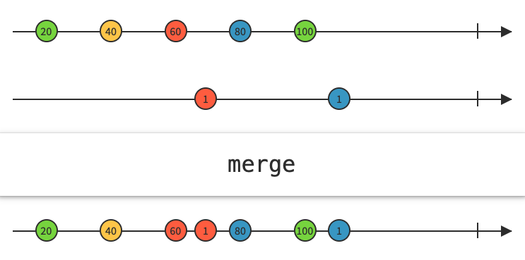

# RxSidedish

코드스쿼드 온라인 반찬 서비스 리팩토링

- 기간: 2021.08.30 - 2021.09.12 (2주)

    2021.09.13 이후는 playground로 활용, 새로운 기술 추가 예정


## 목차

- Architecture
- 특징(사용 기술)
- 리팩토링 내용(고민과 해결)
    - 부드러운 tableView scrolling - Image Practices 리서치
    - ViewModel 역할
    - Unit Test
    - request 고민(main, soup, side)
    - tableView header 구현 리서치
- References


## Architecture


## 특징(사용 기술)

- [RxSwift](https://github.com/ReactiveX/RxSwift)
- [RxDataSources](https://github.com/RxSwiftCommunity/RxDataSources) - 여러 Section, Animation
- [Action](https://github.com/RxSwiftCommunity/Action) - ViewModel에서 action 처리 용이
- [NSObject+Rx]() - NSObject의 하위 클래스에 `Disposable` 추가
- [RxViewController](https://github.com/devxoul/RxViewController) - ViewController Life Cycle에 따른 binding
- [Alamofire](https://github.com/Alamofire/Alamofire)
- [RxBlocking](https://github.com/ReactiveX/RxSwift/tree/main/RxBlocking) - Unit Test
- Coordinator Pattern


## 리팩토링 내용(고민과 해결)


### 부드러운 tableView scrolling - Image Practices 리서치

MainViewController의 `MainTableView` cell 에는 음식 이미지가 들어간다. 서버에서 받아오는 이미지의 크기는 `800x800`에 가까운데 cell imageView 영역에 들어가는 크기에 비하면 낭비가 아닐 수 없다. 방법을 찾다가 image resize를 통해서 memory를 절약할 수 있었다. 밑에는 실제로 크게 줄어든 메모리를 볼 수 있다. 화면에 표시되는 이미지가 많아지고 서버에서 받아오는 이미지 크기가 클 수록 그 차이는 커질 것이다.


```swift
//UIImage+UIGraphicsImageREnderer

extension UIImage {
    func resize(newWidth: CGFloat) -> UIImage {
        let scale = newWidth / self.size.width
        let newHelght = self.size.height * scale
        
        let size = CGSize(width: newWidth, height: newHelght)
        let render = UIGraphicsImageRenderer(size: size)
        let renderImage = render.image { (context) in
            self.draw(in: CGRect(origin: .zero, size: size))
        }
        return renderImage
    }
}
```


위 방법과 더불어 부드러운 scrolling이 되기 위해 하나 더 고려하게 됐다. tableView에서 cell이 reuse될 때 이전 이미지가 지저분하게 남아있지 않기 위해서 단순히 아래와 같이 지정해줬다.

```swift
override func prepareForReuse() {
    super.prepareForReuse()
    sidedishImageView.image = nil
}
```


하지만 방법을 계속해서 찾아보다가 간과한 것이 있었는데 image를 받아오는 비동기 즉, 이미지를 로드하는 네트워크는 계속 진행중이었어서 짧은 시간일지라도 그 `DownloadRequest`는 진행중이었다. `ImageLoader`에서는 `Disposable` 을 리턴하게 해주어 `prepareForReuse()` 에서 `dispose()` 해주어 좀 더 부드러운 tableView scrolling이 가능해졌다.


```swift
override func prepareForReuse() {
    super.prepareForReuse()
    downloadDisposable?.dispose()
}

func loadImage(imageURL: String) {
    let imageWidth = self.sidedishImageView.bounds.width
    downloadDisposable = ImageLoader.load(from: imageURL)
        .drive(onNext: { [weak self] image in
            self?.sidedishImageView.image = image?.resize(newWidth: imageWidth)
        })
}
```


### ViewModel 역할


처음 코드작성 후 ViewController에서 Observable을 처리하는 모습이다. 

```swift
//DetailViewController

viewModel.item //ViewModel에서 비즈니스 로직 처리 후에 넘겨줄 수 있지 않을까?
    .map({ $0.thumbnailImagesURL })
    .flatMap({ Observable.from($0) })
    .flatMap({ ImageLoader.load(from: $0) })
    .subscribe(onNext: { [weak self] image in
        self?.thumbnailStackView.addArrangedImageView(image: image, width: self?.view.bounds.width)
    }).disposed(by: rx.disposeBag)
```

ViewModel을 두고도 비즈니스 로직 처리를 ViewController에서 처리하는것은 View에 영향을 받아 테스트가 어려워지는 단점이 있다. 분리되어야 할 필요가 있다고 느꼈고 이는 ViewController의 코드를 줄여줌과 동시에 `fetchItem`이라는 `AnyObserver` 를 따로 두어 `RxViewController`를 활용한 `bind`에도 쓰이고 테스트에서도 트리거로 사용할 수 있었다.

```swift
//DetailViewController

viewModel.thumbnailImagesURL
    .flatMap({ ImageLoader.load(from: $0) })
    .subscribe(onNext: { [weak self] image in
        self?.thumbnailStackView.addArrangedImageView(image: image, width: self?.view.bounds.width)
    }).disposed(by: rx.disposeBag)
```

```swift
//DetailViewModel

let fetching = PublishSubject<Void>()
let item = PublishSubject<ViewDetailSidedishItem>()

fetchItem = fetching.asObserver()

fetching
    .asObservable()
    .flatMap{ sidedishUseCase.getDetailSideDishItem(hash: detailHash) }
    .map({ ViewDetailSidedishItem(title: title, item: $0) })
    .subscribe(onNext: item.onNext)
    .disposed(by: disposeBag)

sidedishItem = item.asObservable()

thumbnailImagesURL = sidedishItem
    .map({ $0.thumbnailImagesURL })
    .flatMap({ Observable.from($0) })
```


### Unit Test

Unit Test를 위해 RxBlocking을 사용했다. 주요는 Observable 시퀀스를 Blocking Observable로 변환이 가능한 점이 Test를 더 용이하게 해줬다. `toBlocking()` 은 다음과 같이 활용이 가능하다

```swift
let observableNum = Observable.of(1, 2, 3)
do {
    let result = try observableNum.toBlocking().first
} catch {
    XCTFail(error.localizedDescription)
}
```


RxSidedish 프로젝트에서는 이렇게 활용했다

```swift
func test_SidedishesFetch() {
    viewModel.fetchItems.onNext(())

    let fetched = try! viewModel.mainSections.toBlocking().first()!

    XCTAssertEqual(fetched.count == 3, true) // section 개수
    XCTAssertEqual(fetched.flatMap({ $0.items }).count > 0, true) // SidedishItem이 하나 이상 있는지
}
```


### request 고민(main, soup, side)

처음에 비동기식 데이터 스트림 프로그래밍이 익숙하지 않았을때는 `Observable<Observable<MainSection>>` 모양의 요상한 타입이 나오기도 했었다. 이렇게 생각하게 된 이유가 서버 요칭 시 `main`, `soup`, `side`를 따로 요청해야 하는데 결과를 받을 때 그 순서가 보장을 못 받을 것 같다는 우려가 있었다.


이는 잘못된 생각이었고 공부 후 순서가 보장이 가능하다는 점을 알게 됐다. `concat`, `merge` 등 다양한 Operators도 이 때 활용하면 알맞게 활용할 수 있다.




### tableView header 구현 리서치

`RxDataSources`는 여러 Section을 만들기 위해 도입을 했는데 `RxDataSources` 에서 custom `UITableViewHeaderFooterView`를 `UITableViewDelegate` 채택 없이 구현 할 수 있나를 알아봤지만 현재 `RxDataSources` 이외에도 다른 라이브러리에서는 아래 cell 구현처럼 구현이 불가능했다.

```swift
let dataSource = RxTableViewSectionedReloadDataSource<SectionOfCustomData>(
  configureCell: { dataSource, tableView, indexPath, item in
    let cell = tableView.dequeueReusableCell(withIdentifier: "Cell", for: indexPath)
    cell.textLabel?.text = "Item \(item.anInt): \(item.aString) - \(item.aCGPoint.x):\(item.aCGPoint.y)"
    return cell
})
```

결국 `MainTableViewDelegate` 를 분리 후 `tableView.rx.setDelegate`에서 채택했다.

```swift
mainTableView.rx
    .setDelegate(delegate)
    .disposed(by: rx.disposeBag)
```


### Reference

[ReactiveX - Operators](http://reactivex.io/documentation/operators.html)

[Mastering RxSwift](https://www.youtube.com/playlist?list=PLziSvys01Oek7ANk4rzOYobnUU_FTu5ns)

[곰튀김 Youtube](https://www.youtube.com/channel/UCsrPur3UrxuwGmT1Jq6tkQw)

[RxDataSources](https://github.com/RxSwiftCommunity/RxDataSources)

[Dish Icon](https://www.flaticon.com/authors/monkik)

[iOS Memory Deep Dive](https://developer.apple.com/videos/play/wwdc2018/416/)